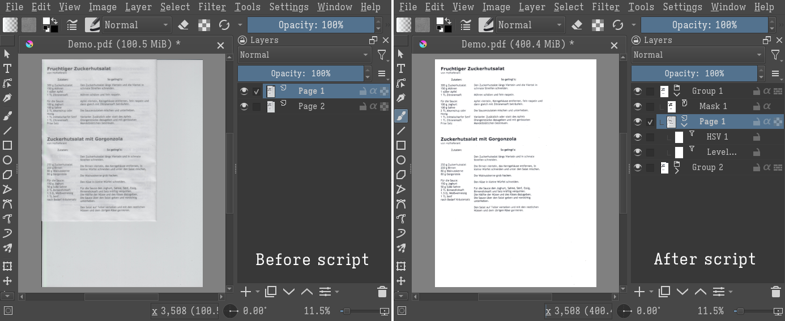

Krita plugin to clean up scanned PDFs, specifically text-heavy documents on light backgrounds with the occasional colored logo. It allows fixing the contrast and saturation of the whole document at once, and making sure the page background is pure white. Individual pages can be adjusted manually.

* Installation
See [[https://docs.krita.org/en/user_manual/python_scripting/krita_python_plugin_howto.html][How to make a Krita Python plugin]]: assuming your [[https://docs.krita.org/en/reference_manual/resource_management.html][resource directory]] is `$HOME/.local/share/krita/`, copy `clean_scans.desktop` and the directory `clean_scans` into `$HOME/.local/share/krita/pykrita/`.

* Usage instructions
1. Open the PDF file in Krita and import all pages.
2. Run the script from Tools > Scripts > Clean up scanned PDFs.
3. On the first run, for each page (each top-level paint layer), the script creates a group with an arrangement of filters:
   - A 'Levels' filter mask: to improve the contrast of the scan.
   - A 'HSV adjustments' filter masks: to brighten or remove colors.
   - A copy of the page with a 'threshold' filter in addition mode: to ensure that the background of the page is pure white, while black regions will remain transparent. The value of the filter should be as high as possible, to get only the background white without eating the content.
4. The filters have random-ish default values that should work decently for most documents. They can be adjusted by right-clicking a filter and selecting 'Properties' (or F3). Assuming all pages are similar, only the filters of 'Group 1' need to be manually adjusted.
5. On subsequent runs, the script updates the filters on all pages to match those of 'Group 1'.
6. Optional manual cleanup. It's important that any new layer is placed inside the correct group for each page.
   - Change the filter settings for any page that might need different values.
   - Paint in white over dark page edges and any remaining stain or dust.
   - Any photograph-like picture will probably be unreadable. Those need to be copied to a different layer to adjust their colors separately from the text.
7. Export the groups as individual JPEG files: Tools > Scripts > Export layers, with option 'Group as layer'.
8. Convert the cleaned images back to PDF, for example with [[https://gitlab.mister-muffin.de/josch/img2pdf][img2pdf]].

The tests in the code are only based on whether each top-level layer is a paint layer or a group (and in that case, whether it's the upper layer or not), so changing the top-level layer structure will break things. Make sure any additional layer is contained within the group corresponding to the right page.
